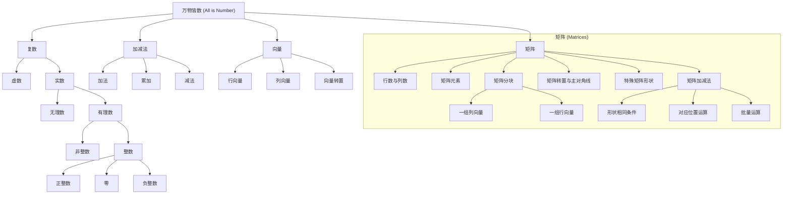

# Week 0：矩阵（Matrices）

*Updated: 2026-08-22 00:13 (GMT+8)*  
*Compiled by Hongfei Yan (2024 Spring)*


在程序设计与数据科学中，输入数据经常以矩阵的形式出现（例如 Python 中的二维列表）。本章将从**数学概念**和**编程实践**两个维度全面介绍矩阵。

## 1.1 知识点：矩阵

> *“万物皆数。”（All is Number.）*  
> —— 毕达哥拉斯（Pythagoras）｜古希腊哲学家、数学家｜570 B.C. — 495 B.C.  
> *(注：参考自姜伟生《数学要素》1.4 与 1.5 节)*




<p align="center"><b>图 1：数的结构体系</b></p>


### 1.1.1 向量：数字排成行与列

向量（Vector）和矩阵（Matrix）等线性代数概念是数据科学与机器学习的基石。在计算机中，绝大多数数据都以矩阵形式存储和运算。线性代数正是连接算术、代数、解析几何、微积分与概率统计的重要桥梁。

#### 1. 行向量与列向量

若干数字排成一行或一列，并用中括号括起来，得到的数组称为**向量**：

* 排成一行的称为**行向量**（Row vector）
* 排成一列的称为**列向量**（Column vector）

$$
\begin{bmatrix}
  1 & 2 & 3 
\end{bmatrix}_{1 \times 3}, \quad
\begin{bmatrix}
  1 \\
  2 \\
  3 
\end{bmatrix}_{3 \times 1} \tag{1}
$$

> **说明**：右下角标 $1 \times 3$ 表示“1 行 3 列”；$3 \times 1$ 表示“3 行 1 列”。

#### 2. 转置 (Transpose)

转置符号为上标 $\mathrm{T}$。行向量转置可得到列向量，列向量转置可得到行向量：

$$
\begin{bmatrix}
  1 & 2 & 3 
\end{bmatrix}^\mathrm{T}
=
\begin{bmatrix}
  1 \\
  2 \\
  3 
\end{bmatrix}, \quad
\begin{bmatrix}
  1 \\
  2 \\
  3 
\end{bmatrix}^\mathrm{T}
=
\begin{bmatrix}
  1 & 2 & 3 
\end{bmatrix}
\tag{2}
$$


### 1.1.2 矩阵：数字排列成长方形

**矩阵**（Matrix）将一系列数字按照长方形表格排列（包含行与列）。
$$
\begin{bmatrix}
  1 & 2 & 3 \\
  4 & 5 & 6
\end{bmatrix}_{2 \times 3}, \quad
\begin{bmatrix}
  1 & 2 \\
  3 & 4 \\
  5 & 6 
\end{bmatrix}_{3 \times 2}, \quad
\begin{bmatrix}
  1 & 2 \\
  3 & 4 
\end{bmatrix}_{2 \times 2}
\tag{3}
$$

通俗地讲，矩阵将数字排列成表格。式（3）给出了三个矩阵，形状分别是 2 行 3 列（记作 $2 \times 3$）、3 行 2 列（记作 $3 \times 2$）和 2 行 2 列（记作 $2 \times 2$）。通常用大写英文字母（如 $A, B, X$）代表矩阵。

图2所示为一个 $n \times D$ 的矩阵 $X$ 表示它包含 $n$ 行（Number of rows）和 $D$ 列（Number of columns）：
$$
X_{n \times D}=
\begin{bmatrix}
  x_{1,1} & x_{1,2} & \cdots & x_{1,D} \\
  x_{2,1} & x_{2,2} & \cdots & x_{2,D} \\
  \vdots & \vdots & \ddots & \vdots \\
  x_{n,1} & x_{n,2} & \cdots & x_{n,D} 
\end{bmatrix}
\tag{4}
$$

<p align="center">
  
</p>
<p align="center"><b>图 2：n×D 矩阵 X</b></p>

* **注意口诀**：先说行序号，再说列序号。
* **矩阵元素**：矩阵 $X$ 中的元素 $x_{i,j}$ 表示第 $i$ 行、第 $j$ 列的数字。例如，$x_{n,1}$ 是矩阵 $X$ 的第 $n$ 行、第 1 列元素。

#### 常用矩阵英文表达

<p align="center">
  
</p>


## 1.2 编程题目实践

### 示例263A. Beautiful Matrix

implementation, 800, https://codeforces.com/problemset/problem/263/A

> You've got a 5 × 5 matrix, consisting of 24 zeroes and a single number one. Let's index the matrix rows by numbers from 1 to 5 from top to bottom, let's index the matrix columns by numbers from 1 to 5 from left to right. In one move, you are allowed to apply one of the two following transformations to the matrix:
>
> 1. Swap two neighboring matrix rows, that is, rows with indexes *i* and *i* + 1 for some integer *i* (1 ≤ *i* < 5).
> 2. Swap two neighboring matrix columns, that is, columns with indexes *j* and *j* + 1 for some integer *j* (1 ≤ *j* < 5).
>
> You think that a matrix looks *beautiful*, if the single number one of the matrix is located in its middle (in the cell that is on the intersection of the third row and the third column). Count the minimum number of moves needed to make the matrix beautiful.
>
> **Input**
>
> The input consists of five lines, each line contains five integers: the *j*-th integer in the *i*-th line of the input represents the element of the matrix that is located on the intersection of the *i*-th row and the *j*-th column. It is guaranteed that the matrix consists of 24 zeroes and a single number one.
>
> **Output**
>
> Print a single integer — the minimum number of moves needed to make the matrix beautiful.
>
> Examples
>
> input
>
> ```
> 0 0 0 0 0
> 0 0 0 0 1
> 0 0 0 0 0
> 0 0 0 0 0
> 0 0 0 0 0
> ```
>
> output
>
> ```
> 3
> ```
>
> input
>
> ```
> 0 0 0 0 0
> 0 0 0 0 0
> 0 1 0 0 0
> 0 0 0 0 0
> 0 0 0 0 0
> ```
>
> output
>
> ```
> 1
> ```
>


这道题是 Codeforces 上非常经典的入门题 **263A - Beautiful Matrix**。

#### 题目大意

给定一个 $5 \times 5$ 的矩阵，其中有 24 个 `0` 和 1 个 `1`。
你可以进行两种操作：
1. 交换相邻的两行。
2. 交换相邻的两列。

目标是将数字 `1` 移动到矩阵的中心位置（即第 3 行，第 3 列）。求所需的最少移动次数。

---

#### 解题思路

1. **寻找 `1` 的坐标**：假设数字 `1` 在第 $r$ 行，第 $c$ 列（行和列的索引从 1 开始，即 $1 \le r, c \le 5$）。
2. **计算曼哈顿距离**：
   - 将 `1` 从第 $r$ 行移动到第 3 行需要 $|r - 3|$ 次行交换。
   - 将 `1` 从第 $c$ 列移动到第 3 列需要 $|c - 3|$ 次列交换。
3. **最终答案** 为：`abs(r - 3) + abs(c - 3)`。

---

#### Python 3 代码实现

```python
def solve():
    # 读取 5 行数据
    for i in range(1, 6):
        # 将输入的每一行转换为整数列表
        row = list(map(int, input().split()))

        # 如果数字 1 在这一行中
        if 1 in row:
            r = i  # 行号 (1-based)
            c = row.index(1) + 1  # 列号 (1-based)

            # 计算并输出移动到 (3, 3) 的最少步数
            print(abs(r - 3) + abs(c - 3))
            break


if __name__ == "__main__":
    solve()
```

---

**复杂度分析**

- **时间复杂度**：一般写作 $\mathcal{O}(n^2)$；本题 $n=5$ 固定，因此也可视为 $\mathcal{O}(1)$。
- **空间复杂度**：$\mathcal{O}(1)$，只使用了极小的常量额外空间存储坐标。


### 示例 E18161：矩阵运算（先乘再加）

matrices, http://cs101.openjudge.cn/pctbook/E18161/

> 现有三个矩阵 $A, B, C$，要求计算矩阵表达式 $A \cdot B + C$ 并输出结果。
>
> **矩阵乘法规则**：
> 矩阵乘法运算必须要前一个矩阵的列数与后一个矩阵的行数相同，
>
> $m \times n$ 的矩阵 $A$ 与 $n \times p$ 的矩阵 $B$ 相乘，得到 $m \times p$ 的矩阵 $D$。
>
> 矩阵 $D$ 的每个元素都由 $A$ 的对应行中的元素与 $B$ 的对应列中的元素一一相乘并求和得到，
> 即`D[i][j] = A[i][0]*B[0][j] + A[i][1]*B[1][j] + …… +A[i][n-1]*B[n-1][j]`
>
> $$D[i][j] = \sum_{k=0}^{n-1} A[i][k] \times B[k][j]$$
>
> ($D[i][j]$表示 $D$ 矩阵中第 i 行第 j 列元素)。
>
> **矩阵加法规则**：
>
> 两矩阵形状（行数与列数）相同时方可相加，
>
> $$E[i][j] = D[i][j] + C[i][j]$$
>
> **输入**
>
> 输入分为三部分，分别是 $A, B, C$ 三个矩阵的内容。
> 每一部分的第一行为两个整数，代表矩阵的行数row和列数col
> 接下来row行，每行有col个整数，代表该矩阵这一行的每个元素
>
> **输出**
>
> 如果可以完成矩阵计算，输出计算结果，与输入格式类似，不需要输出行数和列数信息。
> 如果不能完成矩阵计算，输出"Error!"
>
> **样例 1：输入**
>
> ```
> 3 1
> 0
> 1
> 0
> 1 2
> 1 1
> 3 2
> 3 1
> 3 1
> 3 1
> ```
>
> **样例 1：输出**
>
> ```
> 3 1
> 4 2
> 3 1
> ```
>
> **样例 2：输入**
>
> ```
> 1 1
> 0
> 2 1
> 1
> 3
> 1 1
> 9
> ```
>
> **样例 2：输出**
>
> ```
> Error!
> ```
>
> 提示
>
> 矩阵相乘示例
>
> ```
> | 1 2 3 |   | 7 8 |   | 58 64 |
> | 4 5 6 | × | 9 10| = | 139 154|
> 						|11 12|
> ```
>
> 矩阵相加示例
>
> ```
> | 0 0 |   | 3 1 |   | 3 1 |
> | 1 1 | + | 3 1 | = | 4 2 |
> | 0 0 |   | 3 1 |   | 3 1 |
> ```
>
> 来源：cs101-2017 期末机考备选 & 2018 Mock Exam 2
>


#### 方案一：过程式实现（直接嵌套循环）

通过判断尺寸逻辑，手动完成三重循环乘法与双重循环加法：

```python
A, B, C = [], [], []

# 读取矩阵 A
rows_a, cols_a = map(int, input().split())
for _ in range(rows_a):
    A.append(list(map(int, input().split())))

# 读取矩阵 B
rows_b, cols_b = map(int, input().split())
for _ in range(rows_b):
    B.append(list(map(int, input().split())))

# 读取矩阵 C
rows_c, cols_c = map(int, input().split())
for _ in range(rows_c):
    C.append(list(map(int, input().split())))

# 维度检查：A 的列数必须等于 B 的行数，且 A*B 的形状必须与 C 相同
if cols_a != rows_b or rows_a != rows_c or cols_b != cols_c:
    print("Error!")
else:
    # 矩阵乘加结合计算: D = A * B + C
    D = [[0 for _ in range(cols_c)] for _ in range(rows_c)]
    for i in range(rows_c):
        for j in range(cols_c):
            # 计算 (A * B)[i][j]
            for k in range(cols_a):
                D[i][j] += A[i][k] * B[k][j]
            # 加上 C[i][j]
            D[i][j] += C[i][j]

    for row in D:
        print(*row)
```

若 $A$ 为 $m \times n$、$B$ 为 $n \times p$，乘法耗时为 $\mathcal{O}(mnp)$，加法耗时为 $\mathcal{O}(mp)$；结果矩阵额外占用 $\mathcal{O}(mp)$ 空间。


#### 方案二：优雅实现（面向对象 & 运算符重载 `@` 与 `+`）

> **知识补充**：自 Python 3.5 起引入了 PEP 465，加入了矩阵乘法运算符 `@`。我们可以通过在自定义类中重写魔法方法 `__matmul__` 和 `__add__`，直接实现形如 `A @ B + C` 的数学表达式。

```python
class Matrix:
    def __init__(self, data):
        if data and any(len(row) != len(data[0]) for row in data):
            raise ValueError("Matrix rows must have the same length")
        self.data = data
        self.rows = len(data)
        self.cols = len(data[0]) if self.rows else 0

    def __matmul__(self, other):  # 定义矩阵乘法:  A @ B
        if self.cols != other.rows:
            raise ValueError("Matrix dimensions do not match for multiplication")
        
        # 初始化乘积矩阵
        result = [[0] * other.cols for _ in range(self.rows)]
        for i in range(self.rows):
            for j in range(other.cols):
                for k in range(self.cols):
                    result[i][j] += self.data[i][k] * other.data[k][j]
        return Matrix(result)

    def __add__(self, other):  # 定义矩阵加法:  A + B
        if self.rows != other.rows or self.cols != other.cols:
            raise ValueError("Matrix dimensions do not match for addition")
        result = [
            [self.data[i][j] + other.data[i][j] for j in range(self.cols)]
            for i in range(self.rows)
        ]
        return Matrix(result)

    def __str__(self):  # 定义矩阵格式化输出
        return "\n".join(" ".join(map(str, row)) for row in self.data)


def read_matrix():
    r, c = map(int, input().split())
    data = [list(map(int, input().split())) for _ in range(r)]
    if any(len(row) != c for row in data):
        raise ValueError("Invalid matrix row")
    return Matrix(data)


A = read_matrix()
B = read_matrix()
C = read_matrix()

# === 计算 ===
try:
    # 执行自然的矩阵表达式运算
    D = A @ B + C
    print(D)  # 自动调用 __str__
except ValueError:
    print("Error!")
```

------

`A @ B` 调用 `__matmul__`，就是矩阵乘法

`(A @ B) + C` 调用 `__add__`，就是矩阵加法

如果维度不合法，抛 `ValueError`，就能捕获并输出 `"Error!"`
