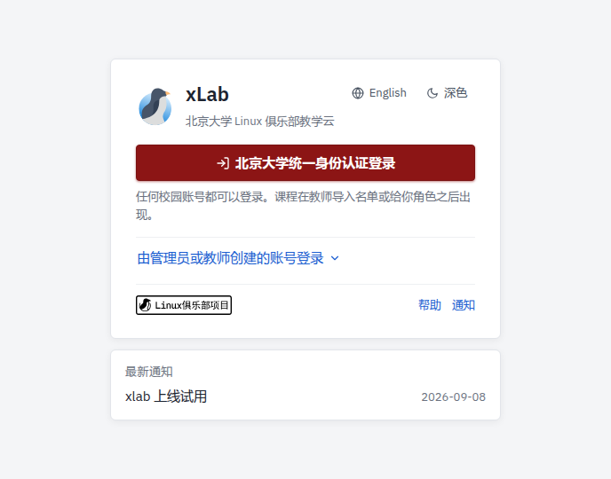
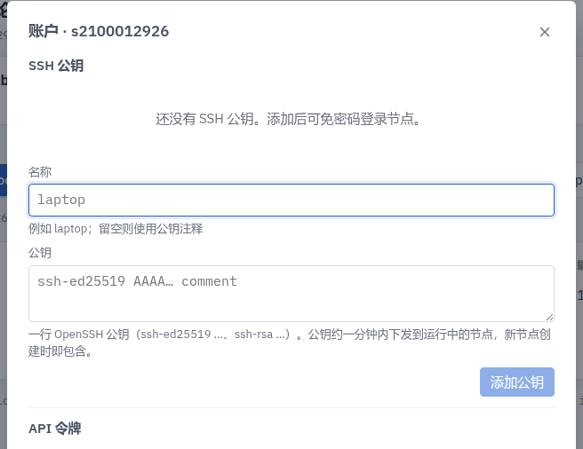
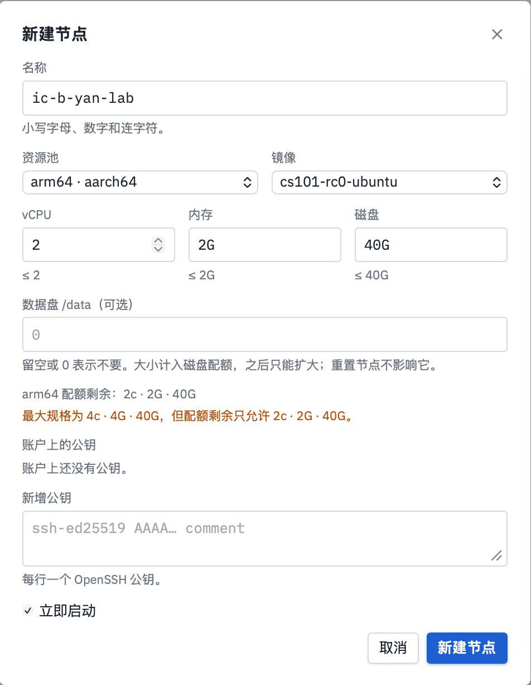
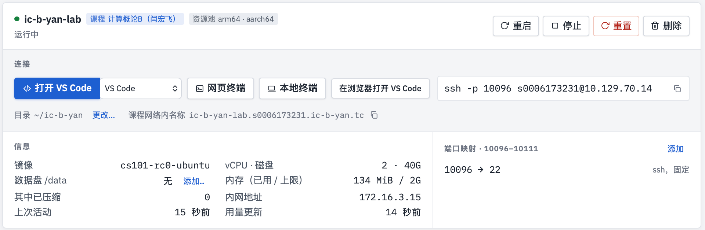

# 第2周 虚拟机、Shell 与开发环境

*Updated 2026-09-14 GMT+8*
 *Compiled by Hongfei Yan (2026 Fall)*
https://github.com/GMyhf/2026fall-cs101

> **课程安排对应**：第 2 周
> **主题与学习重点**：虚拟机、Shell 与开发环境；开始编程语法练习。

**知识点**：三大操作系统对比、虚拟化与虚拟机、云主机的创建与 SSH 连接、交换分区、xLab 课程实验环境（SSH 公钥、节点、VS Code Remote-SSH）、Linux 目录树、Shell 常用命令、文件权限、重定向与管道、Python 虚拟环境（uv）、变量与数据类型、分支与循环、字符串与列表的基本操作、零基础 30 道练手题。

---

# 1 为什么计概课要讲操作系统和 Shell

三个理由：

1. **评测机跑的是 Linux**。你的程序 TLE / MLE / RE 时，看懂错误来自哪一层，需要一点系统知识。
2. **命令行是程序员的通用接口**。装包、跑脚本、批量处理数据、连服务器，全靠它。
3. **第 15 周要跑神经网络**，本地跑不动的实验要放到云主机上。

---

# 2 操作系统入门

## 2.1 三者比较

| | Windows | macOS | Linux |
| ---- | ---- | ---- | ---- |
| 内核 | NT | Darwin（类 Unix） | Linux |
| 默认 Shell | PowerShell / cmd | zsh | bash / zsh |
| 包管理 | winget / choco | Homebrew | apt / yum / dnf |
| 路径分隔符 | `\` | `/` | `/` |
| 换行符 | `\r\n` | `\n` | `\n` |
| 本课定位 | 主力开发机 | 主力开发机 | 评测机 / 云主机 |

**换行符差异是真的会咬人的**：Windows 下写的文本文件，行尾多一个 `\r`，
在 Linux 上 `int(line)` 通常仍能工作（Python 的 `int()` 会忽略空白），
但 `line == "abc"` 会失败。养成 `line.strip()` 的习惯。

## 2.2 虚拟化与虚拟机

**虚拟机（VM）**：用软件模拟出一整台计算机，在其上安装完整的操作系统。

```
   ┌──────────┐ ┌──────────┐ ┌──────────┐
   │  Guest   │ │  Guest   │ │  Guest   │   ← 虚拟机里的操作系统
   │  Linux   │ │  Linux   │ │ Windows  │
   └──────────┘ └──────────┘ └──────────┘
   ┌────────────────────────────────────┐
   │        Hypervisor 虚拟机监视器      │   ← VirtualBox / VMware / KVM
   └────────────────────────────────────┘
   ┌────────────────────────────────────┐
   │           宿主机操作系统            │
   └────────────────────────────────────┘
   ┌────────────────────────────────────┐
   │              物理硬件               │
   └────────────────────────────────────┘
```

**为什么用虚拟机**：隔离（装坏了删掉重建）、一致（和评测环境同构）、可迁移（快照）。

**容器（Docker）**与虚拟机的区别：容器共享宿主机内核，只隔离文件系统与进程空间，
因此**启动快、开销小**，但不能跑不同内核的系统。

## 2.3 云主机

学校提供[云计算实验平台](https://clab.pku.edu.cn/)。创建一台 Ubuntu 云主机后，用 SSH 连接：

```bash
ssh username@ip_address           # 口令登录
ssh -i ~/.ssh/id_rsa user@ip      # 密钥登录（推荐）
ssh -p 2222 user@ip               # 指定端口
```

**首次配置三件事**：

```bash
# 1) 更新系统
sudo apt update && sudo apt upgrade -y

# 2) 生成并上传公钥（在本机执行）
ssh-keygen -t ed25519 -C "you@pku.edu.cn"
ssh-copy-id user@ip

# 3) 传文件
scp local_file.py user@ip:~/            # 本机 -> 云主机
scp user@ip:~/result.txt ./            # 云主机 -> 本机
```

## 2.4 交换分区：内存不够时的救命稻草

云主机常只有 2 GB 内存，跑大模型实验会 OOM。加一块 swap：

```bash
sudo fallocate -l 4G /swapfile        # 建 4GB 文件
sudo chmod 600 /swapfile
sudo mkswap /swapfile                 # 格式化为交换空间
sudo swapon /swapfile                 # 启用
free -h                               # 确认

# 开机自动挂载
echo '/swapfile none swap sw 0 0' | sudo tee -a /etc/fstab
```

> swap 在磁盘上，比内存慢几个数量级。它防的是"崩溃"，不是"变慢"。

## 2.5 xLab：本地连接课程实验环境

课程在 [xLab](https://xlab.pku.edu.cn/) 上为每位同学提供 Linux 节点，本机通过 SSH 连接、用本地 VS Code 编辑远程代码。

| 工具 | 在哪里打开 | 用来做什么 |
| ---- | ---- | ---- |
| 本机终端 | Windows：PowerShell；macOS：终端 Terminal | 输入命令、查看输出 |
| SSH 客户端 | 在本机终端执行 `ssh` | 验证身份，连接远程节点 |
| VS Code + Remote-SSH 扩展 | 在自己的电脑上打开 | 通过 SSH 编辑远程项目 |

> 连接前：命令在本机执行。连接后：命令在远程节点执行，代码也保存在节点上。
> 课前安装：VS Code、Remote-SSH 扩展、SSH 客户端。

### 2.5.1 在本机生成 SSH 密钥

```bash
ssh -V                       # 确认本机有 SSH 客户端
ssh-keygen -t ed25519        # 默认路径按 Enter；若提示 Overwrite 输入 n；口令直接回车两次
cat ~/.ssh/id_ed25519.pub    # 读取公钥，复制输出的一整行
```

| 文件 | 放在哪里 | 作用 |
| ---- | ---- | ---- |
| `~/.ssh/id_ed25519` | 留在自己的电脑 | 私钥，用于证明身份，**不要上传或发给别人** |
| `~/.ssh/id_ed25519.pub` | 公钥内容添加到 xLab | 节点用它验证登录者 |

校园统一认证登录 xLab 网站；SSH 公钥认证登录 Linux 节点。

### 2.5.2 登录 xLab、添加公钥、新建节点

1. 打开 xlab.pku.edu.cn，北京大学统一身份认证登录，在「我的节点」找到「计算概论B」。
   看不到课程请向助教确认名单；xLab 和 autolab 都在校园网内，校外需先连北大 VPN。
2. 右上角账户 → SSH 公钥：填写名称，粘贴 `cat` 输出的整行公钥，点击「添加公钥」。
3. 新建节点：名称默认 `ic-b-yan-lab`，镜像选 `cs101-rc0-ubuntu`，规格保留默认、数据盘留空，勾选「立即启动」，等待「运行中」。账户里已添加的公钥会用于节点登录；已有节点的同学直接继续连接。





节点卡片是本地连接的入口：复制卡片上的 SSH 命令粘贴到本机终端；装好 Remote-SSH 后可以点「打开 VS Code」。



### 2.5.3 从本机终端 SSH 登录

```bash
ssh -p <你的端口> <你的用户名>@<课程IP>   # 尖括号是说明字段，直接复制自己卡片中的命令
```

| 首次连接时可能看到 | 如何处理 |
| ---- | ---- |
| `Are you sure ...?` | 输入 `yes`，按 Enter 继续 |
| `Enter passphrase ...` | 输入自己给私钥设置的口令（默认没有设置） |
| 出现远程命令提示符 | 连接成功，可以开始输入 Linux 命令 |

```bash
whoami                                 # 当前用户
pwd                                    # 当前目录
uname -m                               # CPU 架构
mkdir -p ~/ic-b-2026/xlab-intro-demo
cd ~/ic-b-2026/xlab-intro-demo
ls
exit                                   # 退出 SSH，回到本机终端
```

### 2.5.4 本地 VS Code 连接同一个节点

1. 本机安装 VS Code 和 Microsoft 的 **Remote-SSH** 扩展。
2. F1 → `Remote-SSH: Add New SSH Host...`，粘贴刚才成功的完整 ssh 命令，保存到自己的 SSH 配置文件。
3. F1 → `Remote-SSH: Connect to Host...`，选择刚添加的主机；询问远端系统时选 Linux。
4. `File > Open Folder` 打开远程练习目录 `/home/<你的用户名>/ic-b-2026/xlab-intro-demo`。
5. 以后可在节点卡片直接点「打开 VS Code」；卡片「目录」→「更改…」→ 进入练习目录 →「在此打开」，节点会记住选定的目录。

> 网页终端、「在浏览器打开 VS Code」可作临时替代，与本地连接访问同一节点、同一项目。

在 Explorer 中新建 `hello.c` 并保存（Ctrl+S / Cmd+S）：

```c
#include <stdio.h>

int main(void) {
    printf("Hello, cs101!\n");
    return 0;
}
```

菜单 Terminal > New Terminal，在远程终端编译运行，预期输出 `Hello, cs101!`：

```bash
gcc -Wall -Wextra hello.c -o hello
./hello
```

修改问候语后保存、重新编译、再运行一次，观察输出变化。

### 2.5.5 保存与排错

| 位置 / 操作 | 记住什么 |
| ---- | ---- |
| `~/ic-b-2026` | 保存个人代码，重置节点后保留 |
| `/lec` 与 `/lec/submit` | 课程资料与个人收集目录，提交按课程要求 |
| `exit` / 关闭远程连接 | 结束连接，已保存的文件仍在 |
| 停止 / 重置节点 | 停止会终止进程，重置会恢复系统盘 |

> ⚠️ 平台没有用户备份和快照，重要代码自己另存副本。

先排 SSH，再排 VS Code：

| 现象 | 优先检查 |
| ---- | ---- |
| 找不到 ssh 命令 | 本机是否安装 SSH 客户端 |
| `Connection timed out` | 校园网络 / VPN、自己的 IP / 端口、节点状态 |
| `Permission denied (publickey)` | 用户名、公钥是否同步、是否使用对应私钥 |
| 主机密钥变化警告 | 先向助教核实，不直接关闭主机校验 |
| SSH 成功，VS Code 失败 | Remote-SSH 扩展、输出日志、Server 安装 |

使用非默认密钥时，在连接命令中指定实际私钥路径：`ssh -i <私钥路径> -p <端口> <用户名>@<课程IP>`。
求助时提供：完整命令、错误文本、当前处于本机还是远程。

---

# 3 Linux Shell

## 3.1 目录树与路径

```
/                根目录
├── home/        用户主目录         ~  等价于 /home/你的用户名
├── etc/         配置文件
├── usr/         用户程序（/usr/bin, /usr/local）
├── var/         可变数据（日志 /var/log）
└── tmp/         临时文件（重启会清）
```

- **绝对路径**：以 `/` 开头，如 `/home/yan/code/a.py`
- **相对路径**：相对当前目录，`.` 当前目录、`..` 上级目录、`~` 主目录

## 3.2 必会命令

| 命令 | 作用 | 常用形式 |
| ---- | ---- | ---- |
| `pwd` | 当前目录 | `pwd` |
| `ls` | 列目录 | `ls -la`（含隐藏文件与详情） |
| `cd` | 切换目录 | `cd ..` / `cd -`（回上一个目录） |
| `mkdir` | 建目录 | `mkdir -p a/b/c`（连父目录一起建） |
| `cp` | 复制 | `cp -r src dst`（递归） |
| `mv` | 移动 / 改名 | `mv old new` |
| `rm` | 删除 | `rm -rf dir` ⚠️ **不可恢复** |
| `cat` | 看文件 | `cat a.txt` |
| `head` / `tail` | 看头 / 尾 | `tail -f log`（持续跟踪） |
| `less` | 分页看 | `less big.txt`（`q` 退出） |
| `grep` | 搜内容 | `grep -rn "def main" .` |
| `find` | 搜文件 | `find . -name "*.py"` |
| `wc` | 计数 | `wc -l a.txt` |
| `chmod` | 改权限 | `chmod +x run.sh` |
| `df` / `du` | 磁盘用量 | `du -sh *` |
| `ps` / `top` | 进程 | `ps aux \| grep python` |
| `kill` | 结束进程 | `kill -9 PID` |

> ⚠️ `rm -rf` 没有回收站。执行前先把命令**改成 `ls`** 跑一遍，确认删的是你以为的东西。

## 3.3 文件权限

```
-rwxr-xr--  1 yan staff  1024 Sep  8 10:00 run.sh
│└┬┘└┬┘└┬┘
│ │  │  └── 其他人 others: r--  (4)
│ │  └───── 同组 group:    r-x  (5)
│ └──────── 属主 user:     rwx  (7)
└────────── 类型：- 普通文件，d 目录，l 符号链接
```

`r=4, w=2, x=1`，所以 `chmod 754 run.sh` 等价于上面的权限。

## 3.4 重定向与管道

```bash
python3 a.py < in.txt > out.txt        # 标准输入来自文件，标准输出写入文件
python3 a.py > out.txt 2>&1            # 错误也一起写进去
python3 a.py >> log.txt                # 追加而不是覆盖
cat data.txt | sort | uniq -c | sort -rn | head   # 管道：词频 Top
```

**本课最有用的一条**：本地测试 OJ 程序时，把样例存成 `in.txt`，然后

```bash
python3 solution.py < in.txt
```

比每次手工敲输入快得多，也不会敲错。

## 3.5 快捷键

| 键 | 作用 |
| ---- | ---- |
| `Ctrl+C` | 中断当前程序 |
| `Ctrl+D` | 输入结束（EOF）——**测试读到文件尾的程序时要用** |
| `Ctrl+A` / `Ctrl+E` | 行首 / 行尾 |
| `Ctrl+R` | 反向搜索历史命令 |
| `Tab` | 补全（按两下列出候选） |
| `↑` / `↓` | 翻历史 |

---

# 4 开发环境

## 4.1 Python 虚拟环境（uv）

不同项目依赖不同版本的包，虚拟环境把它们隔离开。本课程用 [uv](https://docs.astral.sh/uv/) 一个工具管好 Python 版本、`.venv` 和第三方包，详见 [Python 开发环境配置指南](../Python_Development_Setup_Mac_Windows.md)：

```bash
uv python install 3.14 --default     # 安装 Python（由 uv 管理）
uv init --no-package MyPython        # 新建项目（--no-package 不能省）
cd MyPython
uv add numpy matplotlib              # 装包，写入 pyproject.toml / uv.lock
uv run main.py                       # 运行，自动使用 .venv，无需 activate
uv remove numpy                      # 卸载包
```

环境坏了 / 换了电脑，删掉 `.venv` 重建：

```bash
rm -rf .venv && uv sync                         # macOS / Linux
Remove-Item -Recurse -Force .venv; uv sync      # Windows PowerShell
```

## 4.2 PyCharm 的两个必用功能

1. **调试器**：在行号左侧点一下打断点 → Debug 运行 → 单步（F8）/ 步入（F7）/ 看变量。
   **不会用调试器就只能靠 `print` 猜**，效率差一个数量级。
2. **直接输入**：右上角选择 Current File，点击运行 ▶；程序执行到 input() 时，在下方 Run 窗口直接输入数据并按回车
   这样在 IDE 里也能直接喂样例

## 4.3 在线可视化

[pythontutor.com](https://pythontutor.com/) 能逐步展示变量、引用与调用栈——
第 8 周讲递归时，它是理解栈帧最快的工具。

---

# 5 编程语法练习

## 5.1 变量与基本类型

```python
n = 42               # int，Python 的整数没有位数上限
x = 3.14             # float，双精度，约 15~16 位有效数字
s = "hello"          # str，不可变
flag = True          # bool，True/False（首字母大写）
items = [1, 2, 3]    # list，可变
pair = (1, 2)        # tuple，不可变
uniq = {1, 2, 3}     # set，无序不重复
d = {"a": 1}         # dict，键值对

print(type(n), type(x), type(s))   # <class 'int'> <class 'float'> <class 'str'>
```

## 5.2 分支

```python
score = int(input())
if score >= 90:
    grade = "A"
elif score >= 80:
    grade = "B"
elif score >= 60:
    grade = "C"
else:
    grade = "F"
print(grade)
```

Python 用**缩进**表示代码块（约定 4 个空格）。**不要混用 Tab 和空格**——
这是初学者第二大坑，报错信息是 `IndentationError` 或 `TabError`。

## 5.3 循环

```python
for i in range(5):          # 0 1 2 3 4
    print(i, end=' ')
print()

for i in range(1, 10, 2):   # 1 3 5 7 9  —— start, stop, step
    print(i, end=' ')
print()

for ch in "abc":            # 直接遍历字符串
    print(ch, end=' ')
print()

for i, v in enumerate(["a", "b"]):   # 0 a / 1 b —— 同时要下标和值
    print(i, v)

n = 5
while n > 0:
    n -= 1
```

`break` 跳出整个循环，`continue` 跳过本次迭代。

## 5.4 字符串常用操作

```python
s = "  Hello, World  "
print(s.strip())            # "Hello, World"   —— 去首尾空白，读输入必备
print(s.strip().lower())    # "hello, world"
print("a,b,c".split(","))   # ['a', 'b', 'c']
print("-".join(["a", "b"])) # "a-b"
print("abc"[::-1])          # "cba"            —— 反转
print("abc".replace("a", "X"))   # "Xbc"
print("abc".find("b"))      # 1，找不到返回 -1
print(len("abc"))           # 3
```

**字符串不可变**：`s[0] = 'X'` 会报错。要改就先转成 list，改完再 `''.join()`。

## 5.5 列表常用操作

```python
a = [3, 1, 2]
a.append(4)          # [3, 1, 2, 4]
a.pop()              # 弹出末尾并返回 4
a.sort()             # 原地排序 -> [1, 2, 3]
b = sorted(a, reverse=True)   # 返回新列表 [3, 2, 1]
print(a[0], a[-1])   # 首、尾
print(a[1:3])        # 切片 [2, 3]
print(sum(a), max(a), min(a), len(a))
print([x * x for x in a if x % 2 == 1])   # 列表推导式 [1, 9]
```

**二维列表的正确建法**：

```python
m, n = 3, 4
grid = [[0] * n for _ in range(m)]        # ✅ 每行独立
wrong = [[0] * n] * m                     # ❌ m 行是同一个列表的别名
wrong[0][0] = 1
print(wrong)   # [[1, 0, 0, 0], [1, 0, 0, 0], [1, 0, 0, 0]] —— 全被改了
```

这是初学者第三大坑，第 6 周处理矩阵时还会遇到。

## 5.6 例题：E02689: 大小写字母互换

**E02689: 大小写字母互换**，<http://cs101.openjudge.cn/practice/02689/>

```python
s = input()
print(s.swapcase())
```

手写版本（理解 ASCII，第 3 周会正面讲）：

```python
s = input()
out = []
for ch in s:
    if 'a' <= ch <= 'z':
        out.append(chr(ord(ch) - 32))
    elif 'A' <= ch <= 'Z':
        out.append(chr(ord(ch) + 32))
    else:
        out.append(ch)
print(''.join(out))
```

## 5.7 例题：E02676: 整数的个数

**E02676: 整数的个数**，<http://cs101.openjudge.cn/practice/02676/>

> 给定 k 个整数，统计其中 1、5、10 出现的次数。

```python
k = int(input())
nums = list(map(int, input().split()))
print(nums.count(1))
print(nums.count(5))
print(nums.count(10))
```

> 注意 `list.count()` 是 O(n)，这里调用三次共 O(3n)，n 很小无所谓。
> **但如果要统计的值有很多种，就该用字典一次扫完**——第 4 周讲复杂度时会回到这一点。

## 5.8 零基础入门：30 道练手题

完整题单与选题原则见 [零基础 Python 入门：30 道练手题](../ADS_30_easy_problems_for_beginners.md)，题解：https://fuynaloft.github.io/sol101/

**入门方案**：

1. **先学语法（几个小时）**：[菜鸟教程 Python3](https://www.runoob.com/python3/python3-tutorial.html)，按目录学到「函数」为止。重点：基础语法、数据类型、运算符、字符串、列表、条件控制、循环、函数。
2. **再做 30 道题（边做边查）**：碰到不会的语法回教程查。**做题是为了补语法，不是为了学算法**。

**选题原则**：只考语法不考算法；难度最低档（Codeforces 800~1000、OpenJudge / LeetCode Easy、洛谷入门）；题意短、数据小；一题对应一个语法点；OpenJudge、Codeforces 读标准输入，LeetCode 补全函数，两种写法都练到。

| 关卡 | 语法点 | 题目 |
| ---- | ---- | ---- |
| 第 0 关 输入与输出 | `print`、`input().split()`、`map`、f-string | sy1 Hello Sunny Why!、P1001 A+B Problem、31183 一道题搞懂输入、31184 一道题搞懂输出 |
| 第 1 关 运算与分支 | `if/else`、`%`、`//`、向上取整 | E02733 判断闰年、E02750 鸡兔同笼、4A Watermelon、50A Domino piling、1A Theatre Square、200B Drinks |
| 第 2 关 循环 | `for/while`、`range`、计数、`is_prime` 函数 | sy875 逃离魔法塔底、E02676 整数的个数、231A Team、158A Next Round、E01003 Hangover、E04138 质数的和与积、E03143 验证“歌德巴赫猜想” |
| 第 3 关 字符串与模拟 | `lower()`、`swapcase()`、双重循环、`bin()` | 112A Petya and Strings、E02689 大小写字母互换、E01218 THE DRUNK JAILER、E191 位1的个数 |
| 第 4 关 列表 | 下标、倒序遍历、拆数位、`in` 判断 | 263A Beautiful Matrix、E66 加一、E3622 判断整除性、E3718 缺失的最小倍数、1 两数之和、E35 搜索插入位置 |
| 第 5 关 排序 | `sort()`、`sorted(key=...)`、字典映射 | 34B Sale、E07618 病人排队、E1331 数组序号转换 |

做完 30 题后可以挑战：31185 一道题搞懂内置排序函数、31180 学生数据统计分析、E18161 矩阵运算。

**先把输入模板写熟**——零基础同学最常见的错误是读错输入，不是算法写错：

```python
n = int(input())                       # 一行一个整数
a, b = map(int, input().split())       # 一行两个整数
nums = list(map(int, input().split())) # 一行多个整数
s = input().strip()                    # 一行字符串
```

**做题建议**：

1. **分清两种题型**：OpenJudge / Codeforces 自己 `input()` 和 `print()`；LeetCode 只补全 `class Solution` 里的函数，用 `return` 返回，**不要写 `input()`**。
2. **看懂评测结果**：`WA` 检查边界和输出格式；`RE` 多半是下标越界或类型没转换；`TLE` 在这 30 题里基本不会碰到，碰到了说明循环写错了。
3. **卡住 20~30 分钟再看题解**，看懂后**关掉题解自己重写一遍**，直到 AC。
4. **把 AI 当老师，不当代笔**：让它解释报错、讲语法点、帮你找 bug，别让它直接写完整代码。机考时没有 AI。
5. **先写能跑的代码**，AC 后再学更简洁的写法；每题记一行笔记，30 题下来就是自己的语法速查表。
6. **节奏**：每天 3~5 题，一到两周做完。

---

# 6 上机实践

**任务**：在 xLab 节点与本机上完成以下流程，截图提交。

1. 在 xLab 添加公钥、新建节点，本机 `ssh` 登录后 `uname -a` 查看内核版本；
2. 用本地 VS Code Remote-SSH 打开 `~/ic-b-2026/xlab-intro-demo`，编译运行 `hello.c`；
3. 建立目录 `~/ic-b-2026/week02`，在其中写一个 `sum.py`，从标准输入读两个整数并输出和；
4. 用 `echo "3 4" > in.txt` 造数据，用 `python3 sum.py < in.txt > out.txt` 运行，`cat out.txt` 查看结果；
5. `chmod +x` 一个 shell 脚本并运行它；
6. 在本机用 uv 新建项目，`uv add` 一个包并 `uv run` 运行。

---

# 7 本周作业

| # | 题目 | 平台 / 编号 | 考点 |
| - | ---- | ---- | ---- |
| 1 | 与 7 无关的数 | 02701 | 循环、取模 |
| 2 | 判断闰年 | 02733 | 分支 |
| 3 | 大小写字母互换 | E02689 | 字符串 |
| 4 | 整数的个数 | E02676 | 列表统计 |
| 5 | 验证"歌德巴赫猜想" | E03143 | 素数判断、枚举 |
| 6 | 多项式时间复杂度 | E23563 | 字符串解析 |
| 7 | 文字排版 | E06374 | 字符串、模拟 |
| 8（选做） | THE DRUNK JAILER | E01218 | 数学规律 / 模拟 |

**思考题**：

1. 为什么 `[[0] * n] * m` 会出问题？用 `id()` 打印每一行的地址验证你的解释。
2. `Ctrl+C` 和 `Ctrl+D` 分别向程序发送了什么？为什么读到文件尾的循环要用后者结束？
3. 用管道统计一个文本文件里出现次数最多的 10 个单词，写出这条命令。

---

# 8 小结

1. 虚拟机 = 完整的模拟计算机；容器 = 共享内核的轻量隔离。评测机是 Linux，所以要懂一点。
2. xLab：私钥留本机、公钥加到平台；`ssh` 与 VS Code Remote-SSH 连的是同一个节点，重要代码自己备份。
3. Shell 的核心是**路径、权限、重定向、管道**四件事；`python3 a.py < in.txt` 是本课最常用的一条命令。
4. `rm -rf` 不可恢复；虚拟环境把项目依赖隔离开，用 uv 管理。
5. Python 语法三大坑：**忘 `int()`**、**Tab/空格混用**、**`[[0]*n]*m` 的别名陷阱**。
6. 读输入一律 `.strip()`；零基础先按 30 道练手题的顺序补语法。

**下周预告**：往下再挖一层——**计算机原理（1/2）**：从图灵机、冯·诺依曼结构到二进制与 ASCII，回答"计算机到底在算什么"。
